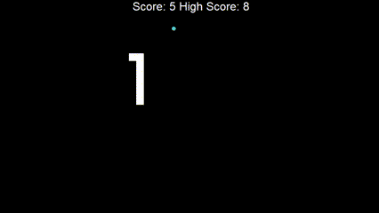

# Snake Game

## Description
Snake is a classic game written in Python using the **turtle** module. In this game, you control a snake to collect food. The goal is to score as many points as possible by eating food, while avoiding collisions with the snake's own body and the walls.

## Features
- **Snake Movement**: The snake can move in four directions – up, down, left, and right.
- **Food Collection**: When the snake reaches the food, it eats it, which causes the snake to grow and increases the player's score.
- **Scoring System**: The player's score is tracked in real time, and the game saves the highest score in the `data.txt` file.
- **Game Reset**: The game automatically resets if the snake collides with its body or the walls.

## Project Files
- **main.py**: The main file responsible for running the game and handling the game loop.
- **snake.py**: The `Snake` class handles the snake's movement logic and collisions.
- **food.py**: The `Food` class generates food in random positions on the screen.
- **scoreboard.py**: The `ScoreBoard` class is responsible for displaying and updating the player's score.

## Requirements
To run the game, you need Python and the `turtle` module.

## Gameplay
Control the snake using the arrow keys: Up, Down, Left, Right.

